# Práce s digitálním modelem terénu

Ve cvičení se naučíte
{: align=center style="font-size: 1.25rem; font-weight: bold; margin-bottom: 10px;"}

-   :material-terrain:{ .xxxl .middle }
    {.middle style="display:table-cell;min-width:40px;padding-right:.8rem;"}

    vytvořit __digitální model terénu__ v GIS včetně úpravy __symbologie__
    {.middle style="display:table-cell;line-height:normal;"}

-   :material-elevation-rise:{ .xxxl .middle }
    {.middle style="display:table-cell;min-width:40px;padding-right:.8rem;"}
    
    zpracovat __LiDARová data__{: .primary_colorx} a následně je vizualizovat nebo použít v analýzách
    {.middle style="display:table-cell;line-height:normal;"}

## Základní pojmy
- **digitální model terénu (DMT)** – digitální reprezentace prostorových objektů (obecný pojem obsahující různé způsoby vyjádření terénního reiéfu nebo povrchu)
- **digitální model reliéfu (DMR)** – digitální reprezentace zemského povrchu (NEbsahuje vegetaci a lidské stavby)
- **digitální model povrchu (DMP)** – digitální reprezentace zemského povrchu (obsahuje vegetaci a lidské stavby, které jsou pevně spojené s reliéfem)
- [**TIN**](https://pro.arcgis.com/en/pro-app/3.1/help/data/tin/tin-in-arcgis-pro.htm) – trojúhelníková nepravidelná síť, která nejlépe reprezentuje povrch jako celek

???+ note "&nbsp;Digitální modely terénu České republiky"
     - **DMP 1G** – Digitální model povrchu České republiky 1. generace (DMP 1G) představuje zobrazení území včetně staveb a rostlinného pokryvu ve formě nepravidelné sítě výškových bodů (TIN) s úplnou střední chybou výšky **0,4 m** pro přesně vymezené objekty (budovy) a **0,7 m** pro objekty přesně neohraničené (lesy a další prvky rostlinného pokryvu). Model vznikl z dat pořízených metodou leteckého laserového skenování výškopisu území České republiky v letech 2009 až 2013. 
     - **DMR 4G** – Digitální model reliéfu České republiky 4. generace (DMR 4G) představuje zobrazení přirozeného nebo lidskou činností upraveného zemského povrchu v digitálním tvaru ve formě výšek diskrétních bodů v pravidelné síti (5 x 5 m) bodů o souřadnicích X,Y,H, kde H reprezentuje nadmořskou výšku ve výškovém referenčním systému Balt po vyrovnání (Bpv) s úplnou střední chybou výšky **0,3 m** v odkrytém terénu a **1 m** v zalesněném terénu. Model vznikl z dat pořízených metodou leteckého laserového skenování výškopisu území České republiky v letech 2009 až 2013.
     - **DMR 5G** – Digitální model reliéfu České republiky 5. generace (DMR 5G) představuje zobrazení přirozeného nebo lidskou činností upraveného zemského povrchu v digitálním tvaru ve formě výšek diskrétních bodů v nepravidelné trojúhelníkové síti (TIN) bodů o souřadnicích X,Y,H, kde H reprezentuje nadmořskou výšku ve výškovém referenčním systému Balt po vyrovnání (Bpv) s úplnou střední chybou výšky **0,18 m** v odkrytém terénu a **0,3 m** v zalesněném terénu. Model vznikl z dat pořízených metodou leteckého laserového skenování výškopisu území České republiky v letech 2009 až 2013. Dokončen byl k 30. 6. 2016 na celém území ČR. (Zdroj: ČÚZK)

## Aplikace Analýzy výškopisu 
Pro analýzu výškopisu ve webovém prostředí slouží mapová aplikace Analýzy výškopisu od Českého úřadu zeměměřického a katastrálního. Aplikace umožňuje provádějí základních výškových analýz nad daty DMP 1G, DMR 4G a DMR 5G. Pro každou datovou sadu nabízí několik rastrových funkcí (Stínovaný reliéf, Z-faktor apod.). Do rozhraní je možné přidat i vlastní data, a tedy zefektivnit používání aplikace v reálné praxi.

[https://ags.cuzk.cz/av/ Analýzy výškopisu ČÚZK](https://ags.cuzk.cz/av/){ .md-button .md-button--primary .button_larger .external_link_icon target="_blank"}
{: .button_array}

<figure markdown>
  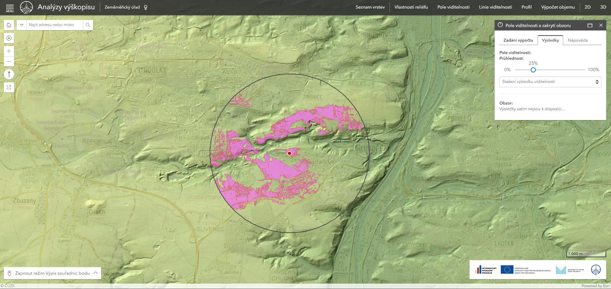{ width="900"}
  <figcaption>Analýza pole viditelnosti ze zadaného bodu vypočteného nad DMR 5G</figcaption>
</figure>

## Vybrané zdroje výškopisných dat
- [ČÚZK Geoprohlížeč](https://ags.cuzk.cz/geoprohlizec/)
    * ZABAGED – [vrstevnice](https://ags.cuzk.cz/arcgis/rest/services/ZABAGED_VRSTEVNICE/MapServer), [DMP 1G](https://ags.cuzk.cz/arcgis2/rest/services/dmp1g/ImageServer), [DMR 4G](https://ags.cuzk.cz/arcgis2/rest/services/dmr4g/ImageServer),  [DMR 5G](https://ags.cuzk.cz/arcgis2/rest/services/dmr5g/ImageServer)
    * INSPIRE – [nadmořská výška (grid)](https://ags.cuzk.cz/arcgis2/rest/services/INSPIRE_Nadmorska_vyska/ImageServer), [nadmořská výška (TIN)](https://ags.cuzk.cz/arcgis2/rest/services/INSPIRE_Nadmorska_vyska_TIN/MapServer)
    * Geoportál Praha – [vrstevnice](https://geoportalpraha.cz/vyhledavani?topic=data&type=[opendata])

## Souřadnicové systémy podporované v prohlížecích a stahovacích službách resortu ČÚZK

Závazné geodetické referenční systémy na území ČR upravuje nařízení vlády č. 159/2023 Sb. v platném znění. 

|     Název                         |     Kód EPSG    |     Poznámka                                                                                          |
|-----------------------------------|:---------------:|-------------------------------------------------------------------------------------------------------|
|     S-JTSK / Krovak East North    |     5514        |     použito Křovákovo zobrazení,   matem. orientace os, definováno od nultého poledníku Greenwiche    |
|     WGS 84 (geographic 2D)        |     4326        |     použito zobrazení geografickými   souřadnicemi (také geografická projekce, nebo geographic 2D)    |
|     WGS 84 / UTM zone 33N         |     32633       |     použito Mercatorovo válcové   konformní zobrazení (UTM zobrazení), základní poledník 15°          |
|     WGS 84 / UTM zone 34N         |     32634       |     použito Mercatorovo válcové   konformní zobrazení, (UTM zobrazení), základní poledník 21°         |
|     ETRS89 (geographic 2D)        |     4258        |     použito zobrazení geografickými   souřadnicemi (také geografická projekce, nebo geographic 2D)    |
|     ETRS89 / TM33                 |     3045        |     použito Mercatorovo válcové   konformní zobrazení (UTM zobrazení), základní poledník 15°          |
|     ETRS89 / TM34                 |     3046        |     použito Mercatorovo válcové   konformní zobrazení, (UTM zobrazení), základní poledník 21°         |

Podrobnější infromace ke [Křovákovu zobrazení](https://maps.fsv.cvut.cz/~cajthaml/vyuka/kar1/prednasky/KAR1_pr6.pdf) a [UTM](https://maps.fsv.cvut.cz/~cajthaml/vyuka/kar1/prednasky/KAR1_pr7.pdf) najdete v přednáškách Kartografie 1 (prof. Cajthaml).

## Zpracování LAS

## Základní pojmy
- **[LiDAR](https://www.geosken.cz/co-je-lidar-a-jak-funguje/)** – metoda dálkového měření vzdálenosti na základě výpočtu doby šíření pulsu laserového paprsku odraženého od snímaného objektu

- **[LAS](https://pro.arcgis.com/en/pro-app/3.1/help/data/las-dataset/las-dataset-in-arcgis-pro.htm)** – datový formát mračna bodů (point cloud) získaných laserovým skenováním

## Použité datové podklady
- [DMR 5G](../../data/#dmr-5g)

- [ortofoto ČÚZK](https://ags.cuzk.cz/arcgis1/rest/services/ORTOFOTO/MapServer)

### Stažení dat z ČÚZK
Z [Geoprohlížeče ČÚZK](https://ags.cuzk.cz/geoprohlizec/) lze stáhnout data laserového skenování (mračno bodů) pro Česko. Získání dat DMR 5G, DMR 4G či DMP 1G lze provést přes výběr daného podkladu v záložce *Produkty*. Dále po rozkliknutí ikony tří teček příslušné vrstvy v záložce *Seznam vrstev* je možné vybrat buď možnost   *Exportovat data* nebo *Stáhnout data (předpřipravené jednotky)*.

???+ note "&nbsp;Možnosti stažení laserových dat z ČÚZK"
     - **Exportovat data** – Touto možností lze data zaslat přímo na email. Zároveň je takto možné stáhnout více kladů dat najednou vlastním výběrem (nakreslením polygonu či nahráním vlastní vrstvy k výběru). Stažená data jsou ve formátu *LAS*.

     - **Stáhnout data (předpřipravené jednotky)** – Takto lze data stáhnout postupně dle předpřipravených kladů. Stažená data jsou ve formátu *LAZ*.

### Převod LAZ do LAS
**1.** Jestliže získáme data ve formátu *ZLAS* nebo *LAZ*, je nutné mračno bodů v ArcGIS Pro konvertovat do formátu *LAS* pomocí funkce [*Convert LAS*](https://pro.arcgis.com/en/pro-app/latest/tool-reference/conversion/convert-las.htm). Takto převedná data již dokáže ArcGIS načíst.

**2.** Do parametru *Input LAS* vložíme z disku vstupní soubor, který chceme převést. Zvolíme adresář výstupních dat *Target Folder* a případně nastavíme parametry převodu.

**3.** Ve druhé části funkce určíme souřadnicový systém mračna bodů. 

<figure markdown>
  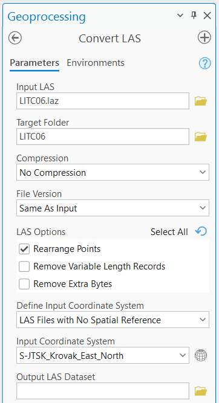{ width="300"}
  <figcaption>Hodnoty funkce Convert LAS</figcaption>
</figure>

### Vizualizace LAS
**1.** LAS data je možné zobrazit 2D v mapě nebo 3D ve scéně (ideálně v lokální scéně). Novou scénu vytvoříme v záložce *Insert* – *New Map* – *New Local Scene*.

<figure markdown>
  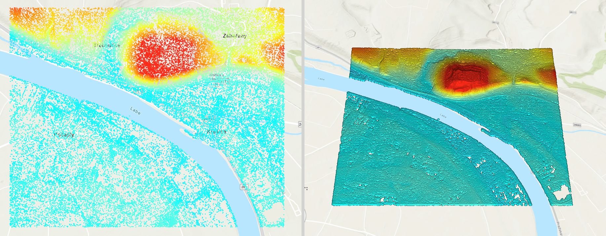{ width="900"}
  <figcaption>Porovnání zobrazení LAS dat ve 2D mapě (vlevo) a ve 3D scéně (vpravo)</figcaption>
</figure>

**2.** Různé možnosti vizualizace LAS jsou dostupné po vybrání vrstvy mračna bodů v záložce *LAS Dataset Layer*. Pod ikonou *Symbology* 

<figure markdown>
  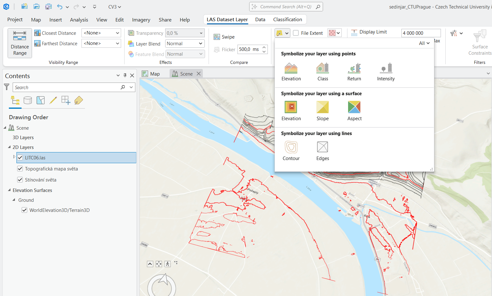{ width="900"}
  <figcaption>Symbologie LAS</figcaption>
</figure>

**3.** Výše zmíněné možnosti symbologie se dělí na tři typy: Vizualizace dle bodů, terénem či liniově. Bodové vizualizace nabízejí zobrazení barvy mračna bodů na základě jeho nadmořské výšky (*Elevation*) nebo klasifikace dat (*Class*). Mračno bodů je dále možné symbolizovat jako terén, přičemž barva může být určená nadmořskou výškou (*Elevation*), sklonem terénu (*Slope*) nebo sklonem ke světové straně (*Aspect*). Třetí možnost, vizualizace vrstvy pomocí linií, nabízí zobrazení vrstevnic (*Contour*) a hran (*Edges*).

???+ note "&nbsp;Zobrazení LAS Dataset Layer"
     V záložce *LAS Dataset Layer* (po vybrání příslušného mračna bodů v *Contents*) lze nejen nastavovat možnosti symbologie, ale také je možné určit hustotu zobrazovaných bodů (sekce *Point Thinning*) nebo filtrovat body (sekce *Filters*).

### Texturovaný LAS
**1.** V některých případech je výhodné mračno bodů obarvit (pokud již texturu neobsahuje v základním nastavení). Stažený LAS z ČÚZK lze otexturovat pomocí ortofota, které se stáhne podobně jako laserová data z [Geoprohlížeče ČÚZK](https://ags.cuzk.cz/geoprohlizec/). Důležité je stáhnout data se stejným kladem, což pro zmíněná data platí.

**2.** Po stažení ortofota vyhledáme v *Geoprocessingu* funkci [*Colorize LAS*](https://pro.arcgis.com/en/pro-app/latest/tool-reference/3d-analyst/colorize-las.htm). Jako *Input Dataset* určímě mračno bodů. Do parametru *Input Image* vložíme vybrané ortofoto a zkontrolujeme přiřazení pásem snímku.

**3.** Dále zvolíme výstupní adresář *Target Folder* a případně specifikujeme název výsledného mračna bodů či jeho kompresi.

<figure markdown>
  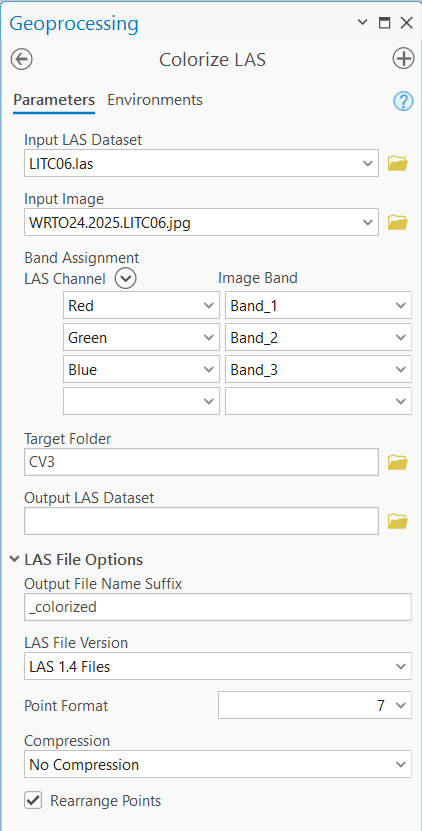{ width="300"}
  <figcaption>Hodnoty funkce Colorize LAS</figcaption>
</figure>

**4.** Po provedení tohoto výpočtu se v nabídce *Symbology*, kterou jsme využívali při vizualizaci, zobrazí další možnost vizualizace mračna bodů – *RGB*. Po jejím zvolení se body obarví dle vstupního ortofota.

<figure markdown>
  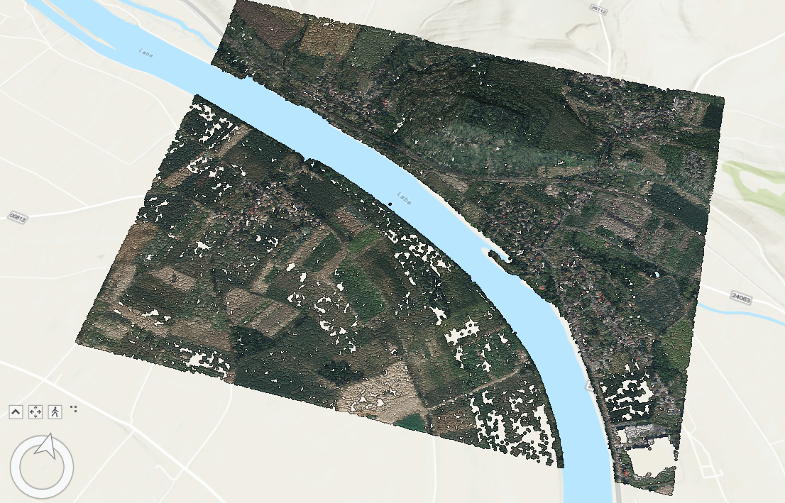{ width="900"}
  <figcaption>Texturovaný LAS</figcaption>
</figure>

### Vytvoření vrstevnic z TIN/LAS

**1.** Nejprve vytvoříme TIN z dat LiDARového skenování. V ArcGISu Pro je k tomu určena funkce [*LAS Dataset To TIN*](https://pro.arcgis.com/en/pro-app/latest/tool-reference/3d-analyst/las-dataset-to-tin.htm). 

<figure markdown>
  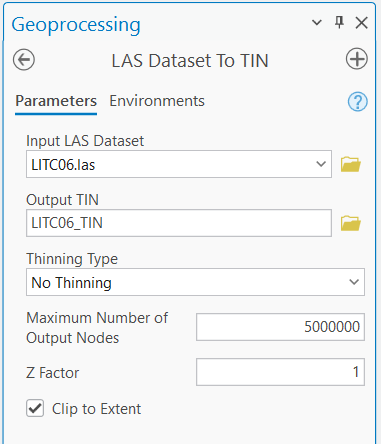{ width="300"}
  <figcaption>Hodnoty funkce LAS Dataset To TIN</figcaption>
</figure>

**2.** Následně je možné pževést TIN do vrstevnic funkcí [*Surface Contour*](https://pro.arcgis.com/en/pro-app/latest/tool-reference/3d-analyst/surface-contour.htm). Funkce také umožňuje přímý převod dat LAS na vrstevnice.

<figure markdown>
  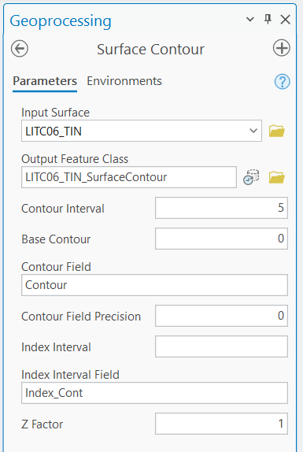{ width="300"}
  <figcaption>Parametry funkce Surface Contour</figcaption>
</figure>

<figure markdown>
  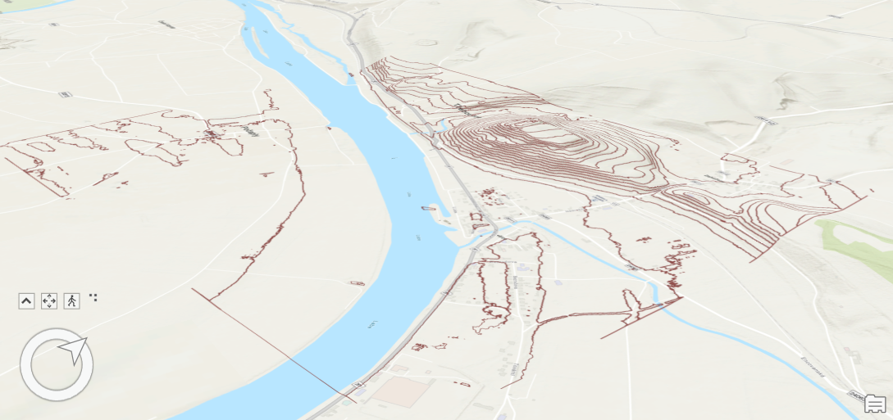{ width="900"}
  <figcaption>Vrstevnice vytvořené z TIN</figcaption>
</figure>

### Vytvoření digitálního modelu terénu
**1.** Data LiDARového skenování slouží jako podklad pro vytvoření digitálního modelu terénu. V ArcGISu Pro je možné převést LAS do rastru pomocí funkce [*LAS Dataset To Raster*](https://pro.arcgis.com/en/pro-app/latest/tool-reference/conversion/las-dataset-to-raster.htm).

**2.** Vstupními daty *Input LAS Dataset* jsou lasetová data ve formátu LAS. *Value Field* určuje hodnotu, na základě které se vypočte výstupní rastr. Jeho umístění určímě v parametru *Output Raster*. 

**3.** Následně je nutné určit způsob interpolace (viz [cvičení 5 GIS 2](https://k155cvut.github.io/gis-2/cviceni/cviceni5/)). Důležitým parametrem je *Cell Size*, která určuje velikost pixelu (buňky) výstupního rastru. *Z factor* určuje hodnotu zploštění/zvýšení hodnot rastru. V základním nastavení jej ponecháme rovný 1.

<figure markdown>
  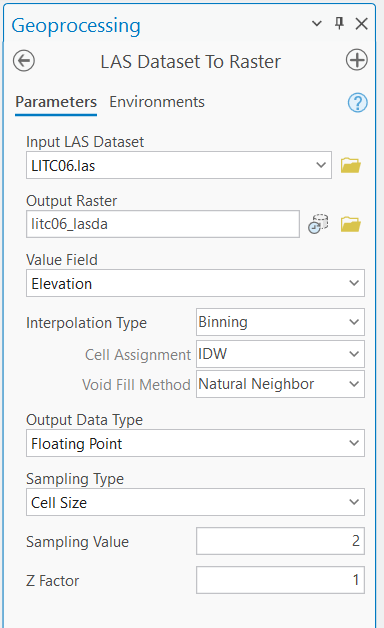{ width="300"}
  <figcaption>Hodnoty funkce LAS Dataset To Raster</figcaption>
</figure>

<figure markdown>
  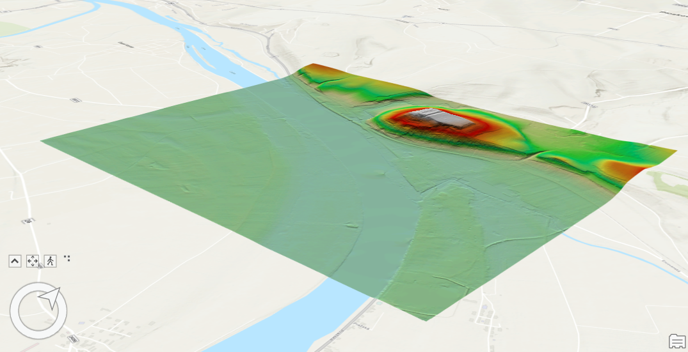{ width="900"}
  <figcaption>Digitální model terénu vypočtený na základě laserových dat</figcaption>
</figure>

### Odečet výšek z digitálního modelu terénu

**1.** Vytvoříme linii a necháme podél linie vygenerovat body ve zvolené vzdálenosti funkcí [*Generate Points Along Lines*](https://pro.arcgis.com/en/pro-app/3.4/tool-reference/data-management/generate-points-along-lines.htm). 

<figure markdown>
  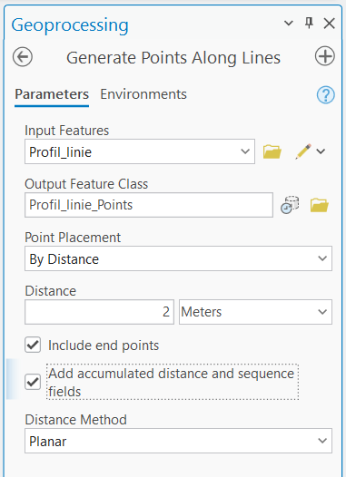{ width="300"}
  <figcaption>Parametry funkce Generate Points Along Lines</figcaption>
</figure>

**2.** Nově vytvořené bodové vrstvě přiřadíme výšky z TIN/LAS/DMR funkcí [*Add Surface Information*](https://pro.arcgis.com/en/pro-app/3.5/tool-reference/spatial-analyst/add-surface-information.htm). Na obrázku níže je výška extrahována z TIN. 

<figure markdown>
  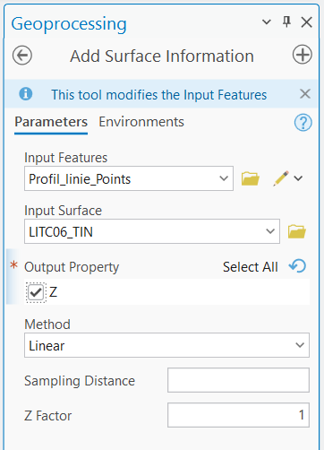{ width="300"}
  <figcaption>Funkce Add Surface Information</figcaption>
</figure>

**3.** Do atributové tabulky přibyl nový atribut *Z* do kterého byla uložena výška z TIN. 

### Viditelnostní analýza

**1.** Viditelnostní analýza se provádí funkcí [*Geodesic Viewshed*](https://pro.arcgis.com/en/pro-app/3.4/tool-reference/spatial-analyst/viewshed-2.htm).

<figure markdown>
  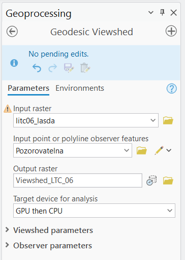{ width="300"}
  <figcaption>Nastavení funkce Geodesic Viewshed</figcaption>
</figure>

<figure markdown>
  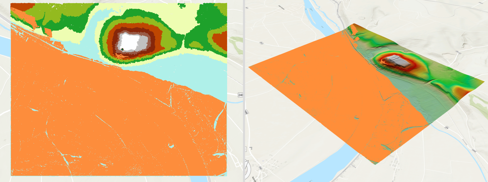{ width="900"}
  <figcaption>Porovnání zobrazení Geodesic Viewshed ve 2D mapě (vlevo) a ve 3D scéně (vpravo)</figcaption>
</figure>

### Generování profilu

**1.** Po nakreslení linie profilu se funkcí [*Stack Profile*](https://pro.arcgis.com/en/pro-app/latest/tool-reference/3d-analyst/stack-profile.htm) vygeneruje tabulka se atributem vzdálenosti od počátku a atributem výšky. 

<figure markdown>
  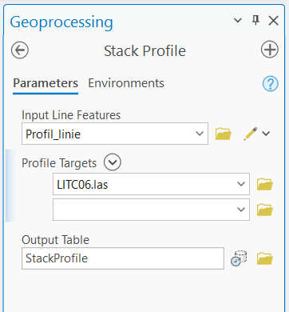{ width="300"}
  <figcaption>Aplikace funkce Stack Profile</figcaption>
</figure>

**2.** Následně je možné vygenerovat liniový graf profilu. Jako *Date or Number* se nastaví pole *FIRST_DIST* a *Numeric Field(s)* se nastaví *FIRST_Z*. Obdobně lze generovat graf v úloze *Odečet výšek z digitálního modelu terénu*.

<figure markdown>
  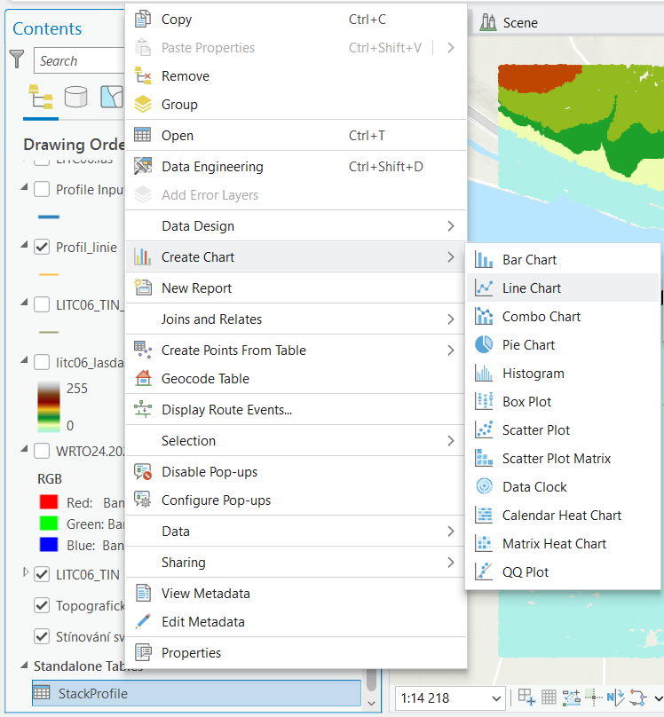{ width="450"}
  <figcaption>Volba liniového grafu</figcaption>
</figure>

<figure markdown>
  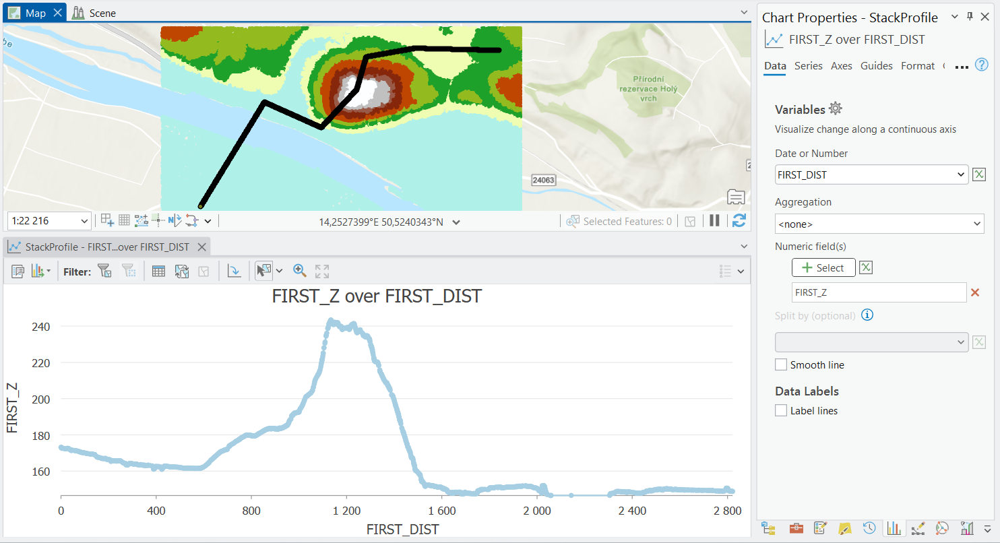{ width="900"}
  <figcaption>Nastavení parametrů liniového grafu</figcaption>
</figure>

     