# Práce s externími daty (Excel, CSV), join, georeferencování rastrových dat

## Práce s externími daty (Excel, CSV), join

Následující úloha se soustředí na možnosti importu externích (tabulárních) dat a jejich připojení na prostorová data.

Prostřednictvím společného pole (klíče) lze přiřadit záznamy v jedné tabulce se záznamy v jiné tabulce (vrstvě). K vrstvě parcel můžete například přidružit tabulku informací o vlastnictví parcel, protože sdílejí pole identifikace parcely. Tato přidružení můžete vytvořit několika způsoby, včetně dočasného spojení či vytvoření trvalejších tříd vztahů uvnitř geodatabáze. Spojení může být také založeno na prostorovém umístění.

## Základní pojmy

[:material-open-in-new: pro.arcgis.com Join the attributes from a table](https://pro.arcgis.com/en/pro-app/latest/help/data/tables/joins-and-relates.htm#GUID-39C9610A-6A73-4985-ADB8-7354EA9DB8BF){ .md-button .md-button--primary .url-name target="_blank"}
[:material-open-in-new: pro.arcgis.com Join data by location (spatially)](https://pro.arcgis.com/en/pro-app/latest/help/data/tables/joins-and-relates.htm#GUID-7B11EAA4-35E0-4B8D-AFB6-4A435761574B){ .md-button .md-button--primary .url-name target="_blank"}
[:material-open-in-new: pro.arcgis.com Remove join](https://pro.arcgis.com/en/pro-app/latest/help/data/tables/joins-and-relates.htm#ESRI_SECTION1_6507320BCB1E45219A88F1AA0A24F7B9){ .md-button .md-button--primary .url-name target="_blank"}
{: align=center style="display:flex; justify-content:center; align-items:center; column-gap:20px; row-gap:10px; flex-wrap:wrap;"}

## Použité datové podklady

- Polygony [městských částí](../assets/cviceni4/MESTSKECASTI.zip) Prahy
- Tabulka pražských [poboček Městské policie](../assets/cviceni4/objekty_MPP.xlsx) ve fromátu XLSX

Pozn. Data jsou dostupná rovněž na S:\K155\Public\155GIS1

## Pracovní postup

**1.** Přidáme polygonovou vrstvu městských částí Prahy do projektu, prohlédneme atributovou tabulku, seznámíme se s daty. V nastavení projektu zvolíme souřadnicový systém S-JTSK (EPSG:5514).

**2.** Dále otevřeme tabulku poboček městské policie v Praze v MS Excel. Jelikož tabulka obsahuje také sloupce se souřadnicemi v S-JTSK, bude možné ji připojit do projektu a vykreslit. Zavřeme Excel a pomocí *Add Data* a *XY Point Data* vyhledáme tabulku (je nutné vybrat přímo list souboru XLSX) viz obrázek. Souřadnice X, Y asociujeme s příslušnými poly tabulky (propíší se pravděpodobně automaticky) a zvolíme správný souřadnicový systém (EPSG:5514).

<figure markdown>
  { width="400"}
  <figcaption>Přidání bodových dat do projektu</figcaption>
</figure>

<figure markdown>
  { width="300"}
  <figcaption>Dialogové okno pro nahrání bodových dat se souřadnicemi z tabulky</figcaption>
</figure>

**3.** V této fázi máme dvě vrstvy: bodovou (pobočky MPP) a polygonovou (MČ Prahy). Pro zopakování bude nejprve vhodné vyzkoušet prostorové připojení prvků. Např. bychom mohli zjistit, kolik poboček MPP se nachází v každé MČ Prahy a dále, jaká je jejich celková kapacita, jinými slovy, kolik příslušníků Městské policie spadá do každé městské části. Ačkoliv jsou dotazy dva, je možné je zpracovat najednou. Pravým kliknutím na vrstvu MČ vyvoláme přes *Joins and Relates* a *Add Spatial Join* dialogové okno. Defaultní nastavení je nutné upravit. Za prvé, v sekci *Output Fields* lze definovat pravidla pro připojení jednotlivých polí z tabulky. Vzhledem k tomu, že úkolem je zjistit celkovou kapacitu, lze všechna pole kromě kapacity smazat a pro pole kapacita vybrat z nabídky pravidel (*Merge Rule*) sumu (viz obrázek). Za druhé je potřeba zaškrtnout parametr *Keep All Target Features*, aby byly zachovány všechny původní prvky, včetně takových, ke kterým nebude prostorově připojen žádný prvek.

<figure markdown>
  { width="300"}
  <figcaption>Atributové pravidlo u prostorového připojení dat</figcaption>
</figure>

**4.** Tímto způsobem se obohatí původní vrstva MČ o nová data dle definovaných pravidel. Po otevření atributové tabulky jsou nově připojené záznamy přidruženy z pravé strany. Zajímavý atribut, který se vytváří automaticky pro každý *Spatial Join*, představuje *Join_Count*. Ten obsahuje počet prvků, které byly k danému (původnímu) prvku připojeny (zde se jedná o počet poboček MPP v dané MČ). Tímto způsobem je např. možné zjistit:

>>**a.** která MČ disponuje nejvíce pobočkami MPP

>>**b.** ve kterých MČ není žádná pobočka MPP

>>**c.** ve které MČ pracuje nejvíce pracovníků městské policie

**5.** K vrstvě dat je všakmožné připojit data i na základě jiného vztahu než prostorového. Např. bychom mohli zjistit, kolik policistů v dané MČ připadá na 100 místních obyvatel. Nejprve je nutné získat data: největším poskytovatelem otevřených statistických dat v ČR je Český statistický úřad. Na jeho webu v sekci [veřejná databáze](https://vdb.czso.cz/) otevřeme *vlastní výběr* a v tabulce *ukazatele* vybereme postupně *Sčítání lidu, domů a bytů 2021 – Obyvatelstvo – Počet obyvatel s obvyklým pobytem – celkem*. Vybraný ukazatel se zobrazí v pravé části okna a postoupíme dále k definici území. Zde zvolíme *městské části* a výběr omezíme filtrem na Prahu (tzn. výběr zahrne pouze 57 MČ Prahy). V dalším kroku zatrhneme nejnovější období a v interaktivním náhledu struktury tabulky prohodíme pozice *území* a *ukazatele* tak, aby MČ byly v řádcích a ukazatel ve sloupci. V posledním kroku se zobrazí náhled tabulky (viz obrázek) a data lze exportovat ve formátu XLSX (pomocí ikony diskety; není nutné zahrnouvat poznámky k textu ani hodnotám).

<figure markdown>
  { width="450"}
  <figcaption>Náhled na první řádky vygenerované tabulky z veřejné databáze ČSÚ</figcaption>
</figure>

**6.** Po stažení tabulky s demografickým údaji MČ Prahy je vhodné data zkontrolovat a upravit. Soubor obsahuje tři listy, přičemž jsou zapsána hned na prvním (DATA). Ideální postup na úpravu dat zní následovně: vložit nový list, označit všechny buňky tabulky (57 MČ a příslušné počty obyvatel), překopírovat označené do nového listu (pomocí *Vložit jinak – Hodnoty*), přidat první řádek a pojmenovat sloupce (např. NAZEV_MC a POCET_OBYV).

Dále je nutná rozvaha, na základě čeho tabulární data propojit s prostorovými. V polygonové vrstvě MČ jsou obsaženy 2 varianty názvů, které se však neshodují s názvem v tabulce. Nicméně není problém tabulku upravit: pomocí funkce *najít a nahradit* (klávesová zkratka CTRL + H) lze upravit názvy MČ. Konkrétně odstranit výrazy "městká část " a " (obec Praha)". Pozor, důležité je vždy zahrnout mezeru za, resp. před daným výrazem. Tímto postupem lze tedy vyhledat všechny výskyty daných výrazů a hromadně je nahradit prázdným řetězcem (do pole *nahradit* nevyplníte nic).

Nakonec ještě pro jistotu změňte formát buněk s počty obyvatel na *číslo* (datový typ buněk lze změnit případně i v ArcGIS Pro). Takto připravená data uložte jako soubor CSV UTF-8.

**7.** Následuje připojení tabulárních dat k vrstvě MČ. Znovu pomocí volby *Joins and Relates* a tentokrát *Add Join* otevřeme dialogové okno. *Input table* představuje vrstvu, ke které se data připojují, *Target table* označuje připojovanou tabulku. *Join field* pro každou z tabulek představuje atribut, na základě kterého se budou tabulky připojovat.

???+ note "&nbsp;Pozn."
      Pokud připojujeme tabulky ve smyslu 1:1, jako ideální *Input/Target Join field* volte unikátní identifikátor s datovým typem integer. Textové řetězce mohou být při propojování tabulek zrádné, některé znaky nemusí být podporovány a řetězce musí být 100% shodné (např. mezera je platný znak a může způsobit nepřipojení prvků).

Výběr *Target Join field* nenabízí mnoho možností: pouze název MČ a počet obyvatel. Vzhledem k tomu, že ČSÚ v datové sadě neposkytuje kódy MČ, bude nutné připojit záznamy na základě textových řetězců, proto zvolíme *MC_NAZEV*. V atributové tabulce MČ se nachází dvojice různých názvů: *NAZEV_1* a *NAZEV_MC*. Vybereme tedy jeden z nich jako *Input Join field*.

<figure markdown>
  { width="350"}
  <figcaption>Dialogové okno pro připojení tabulky</figcaption>
</figure>

V této fázi je vždy rozumné provést validaci pomocí *Validate Join*. Jedná se o rychlou kontrolu, resp. report o performanci připojení. Pozornost věnujte zejména posledním řádkům, ze kterých vyplývá, kolik záznámů bylo připojeno (v našem případě je nutné připojit k 57 MČ 57 záznamů z ČSÚ – viz obrázek).

<figure markdown>
  { width="500"}
  <figcaption>Validace připojení tabulky</figcaption>
</figure>

**8.** Nyní si lze prohlédnout atributovou tabulku MČ, ke které byla pomocí *Spatial Join* připojena bodová vrstva poboček MPP a přes *Add Join* tabulární data s počtem obyvatel. Pro výpočet úlohy s počtem policistů na 100 obyvatel je nutné vytvořit nové pole atributové tabulky (s názvem např. *PREPOCET*), ve kterém bude kýžená hodnota vypočtena pomocí *Calculate Field* a zadáním správného výrazu, který kombinuje data ze všech připojených zdrojů (celková kapacita, počet obyatel).

<figure markdown>
  { width="350"}
  <figcaption>Zadání výrazu pro výpočet počtu policistů na 100 obyvatel MČ</figcaption>
</figure>

???+ note "&nbsp;Pozn."
      Pokud si přejeme vrstvu s připojenými daty trvale uložit např. do geodatabáze, lze po pravém kliknutí na vrstvu vybrat *Data* a funkci *Export Features*. Takto exportovaná data budou o nové záznamy obohacena, tzn. budou obsahovat veškerá původně připojená data. Naopak, pokud připojená data sloužila např. pouze k výpočtu nového atributu a pro další práci již nejsou potřeba, je vhodné *joiny* odstranit pomocí *Joins and relates* a *Remove Join* (s následným výběrem daného joinu) či *Remove all joins* pro kompletní odebrání připojených dat.

**9.** Výsledek však nemusí zůstat jen u čtení tabulárních dat; relativní data vztažená k administrativním dílům lze vizualizovat pomocí kartografické metody zvané kartogram
(více o metodách tematické kartografie se dozvíte v předmětech Kartografie 2 a Kartografie 3 viz [samostatná dokumentace](../kar2/kartogram)). Po pravém kliknutí na vrstvu
a kliknutí na *Symbology* lze změnit *Primary symbology* na *Graduated Colors* z kategorie vizualizace kvantitativních dat. Pak stačí zvolit atribut, který bude pro vizualizaci
použit (případně další parametry, podrobněji viz zmíněná dokumentace kartografických předmětů).

Kompozici možno doplnit o názvy; v panelu *Labeling* stačí aktivovat popis a vybrat atribut, kterým budou polygony popsány. Opět se jedná o téma, kterému se věnuje detailně [samostatná dokumentace](../kar2/popisy).

## Tabulky bez geometrie

Některá data mohou obsahovat __pouze atributovou tabulku__ (tedy žádné prvky). I přes absenci geometrie se však může jednak o __geoprostorová data__. Prostorová složka může být nahrazena tabulkovými záznamy – _např._{.primary_color .icon-example .no-dec} __bodovými souřadnicemi__ či __adresou__ (slovní reprezentace polohy). Tyto údaje je totiž možné pomocí GIS analýzy __převést na geometrii__.

I kdyby však data prostorovou složku vůbec neměla, mohou v GIS dobře posloužit – přes tzv. __Join__ je lze napojit na jiná data, která už polohové údaje mají (toto téma bude probíráno v další části kurzu).

Tabulková data lze do ArcGIS Pro načíst jak z `geodatabáze`, tak z externího souboru `CSV` či `XLSX`.

[Tables](https://pro.arcgis.com/en/pro-app/latest/help/data/tables/tables-in-arcgis-pro.htm){ .md-button .md-button--primary .button_smaller .external_link_icon target="_blank"}
[Open tabular data](https://pro.arcgis.com/en/pro-app/latest/help/data/tables/open-tabular-data.htm){ .md-button .md-button--primary .button_smaller .external_link_icon target="_blank"}
{: .button_array}

## Rastrová data, georeferencování

Seznámení se s rastrovými daty v GIS a ukázka využití těchto dat. Souřadnicové připojení rastrových dat. Práce s Mosaic Dataset. 

## Základní pojmy

- **rastr** – datová struktura založená na buňkách uspořádaných do řádek a sloupců, kde hodnota každé buňky reprezentuje hodnotu jevu
- [**rastrová data**](https://pro.arcgis.com/en/pro-app/latest/help/data/imagery/introduction-to-raster-data.htm) – prostorová data vyjádřená formou matice buněk nebo pixelů; spojitá data (nejčastěji digitální modely terénu, digitalizované mapy)
- [**pixel (buňka)**](https://pro.arcgis.com/en/pro-app/latest/help/data/imagery/pixel-size-of-image-and-raster-data-pro-.htm) – základní geometrický prvek zpravidla čtvercového tvaru; jeho množina vytváří rastrový digitální obraz; 1 buňka = 1 hodnota
- [**prostorové rozlišení rastru**](https://pro.arcgis.com/en/pro-app/latest/tool-reference/environment-settings/cell-size.htm) – velikost 1 buňky (pixelu) rastru (cell size)
- [**resample**](https://pro.arcgis.com/en/pro-app/latest/tool-reference/data-management/resample.htm) – změna prostorového rozlišení rastru
- [**transformace**](https://pro.arcgis.com/en/pro-app/latest/help/mapping/properties/geographic-coordinate-system-transformation.htm) – obecný pojem pro výpočet, jehož cílem je převod souřadnic bodů z jednoho souřadnicového systému do druhého
- [**georeference**](https://pro.arcgis.com/en/pro-app/3.0/help/data/imagery/overview-of-georeferencing.htm) – souřadnicové určení snímku
- [**pyramidování rastru**](https://pro.arcgis.com/en/pro-app/latest/help/data/imagery/raster-pyramids.htm) – ukládání dat do menšího rozlišení pro rychlejší práci; pyramidy (náhledy) jsou uloženy v souborech *.ovr*
- [**mosaic dataset**](https://pro.arcgis.com/en/pro-app/latest/help/data/imagery/mosaic-datasets.htm) – mozaika; datová sada sjednocující jeden či více rastrů; umožňuje ořez mimorámových údajů

### Ukázka nejčastějších rastrových typů dat

-   :material-elevation-rise:{ .lg .middle height} __Digitální model terénu/reliéfu__

    ---

    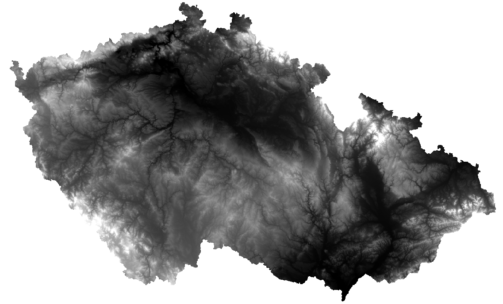

-   :material-grid:{ .lg .middle } __Stínovaný reliéf__

    ---

    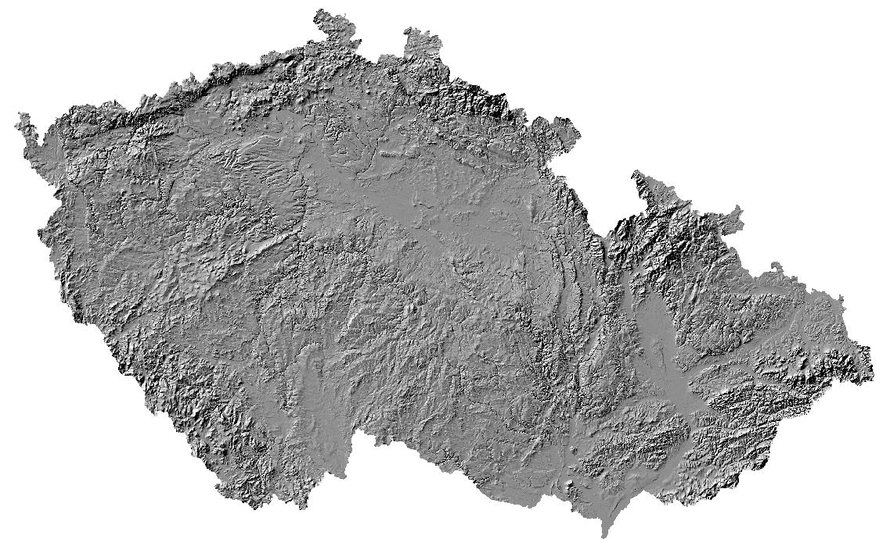

-   :material-map:{ .lg .middle } __Naskenovaný mapový list__

    ---
    

-   :material-airplane:{ .lg .middle } __Ortofoto__

    ---
    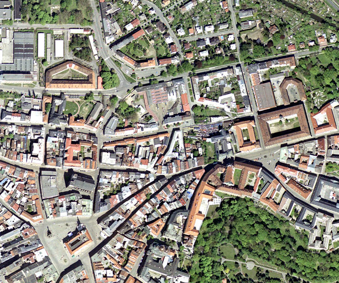

-   :fontawesome-solid-satellite:{ .lg .middle } __Družicová data__

    ---
    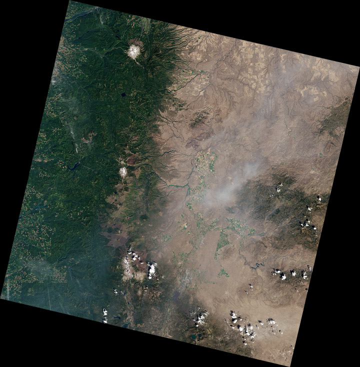

Snímek (letecký snímek) je pořízen středovým promítáním. Při georeferencování leteckých snímků je nutné brát v patrnost jeho zkreslení (radiální posuny pixelů) v důsledku hloubkové členitosti zachycených objektů a terénu. Pro georeferencování snímku je obvykle využita projektivní transformace (kolineární transformace). 

### Georeferencování rastru

**Zdroj dat** – ČÚZK

**Návod ke georeferencování:**

**1.** Načtení rastru do mapového okna z adresáře v záložce _:material-tab: Catalog_{: .outlined_code} . Rastr se umístí po počátku aktuálního souřadnicového systému. Přiblížit se na něj lze po kliknutí pravým tlačítkem na jeho název v záložce _:material-tab: Contents_{: .outlined_code}  → _:material-form-dropdown: Zoom To Layer_{: .outlined_code} .

**2.** Následně zapneme funkci Georeference: záložka _:material-tab: Imagery_{: .outlined_code}  → _:material-button-cursor: Georeference_{: .outlined_code} .

<figure markdown>
  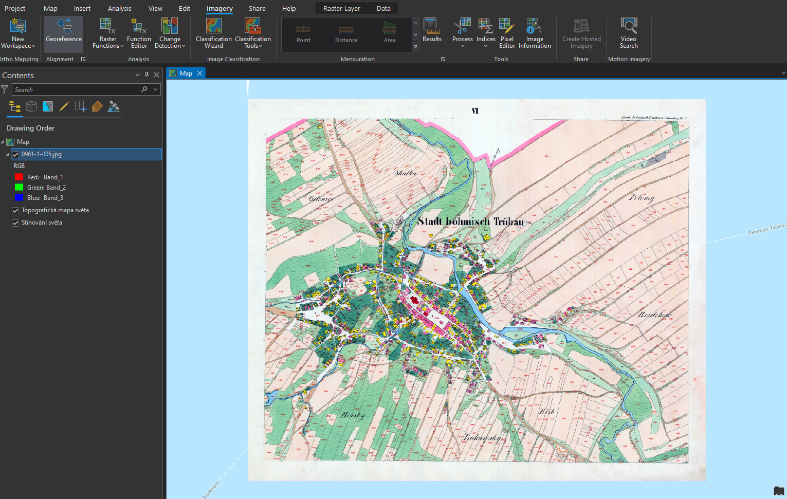
  <figcaption>Georeferencování rastru</figcaption>
</figure>

**3.** V nástroji _:material-button-cursor: Georeference_{: .outlined_code} je potřeba nastavit identické body, na základě kterých se mapový list transformuje do souřadnicového systému mapy.

**4.** Mapu přiblížíme na výřez obrazovky tlačítkem _:material-button-cursor: Fit to Display_{: .outlined_code} .

**5.** Pokud již známe identické body, je možné je importovat pomocí _:material-button-cursor: Import Control Points_{: .outlined_code}. Jestliže tyto body nemáme, musíme je ručně vytvořit tlačítkem _:material-button-cursor: Add Control Points_{: .outlined_code} .

**6.** Při vkládání bodů se nejprve určí bod ze vstupního mapového listu (_:material-button-cursor: source_{: .outlined_code}) a následně jeho ekvivalent v mapě (_:material-button-cursor: target_{: .outlined_code}). Důležité je vybírat identické body rovnoměrně po celé ploše mapového listu a ideálně vybírat taková místa, která jsou na obou vrstvách (mapový list a podkladová mapa) totožná. Nejčastěji se jedná o rohy významných budov (kostely), křížení silnic či boží muka. Identické body a jejich přesnost určujeme dle měřítka georeferencované mapy.

**7.** V některých případech je velmi obtížné najít identické body, zejména u starších archiválií. Na příkladu, který je uveden v tomto návodu, je patrná obrovská změna využití ploch v České Třebové.

<figure markdown>
  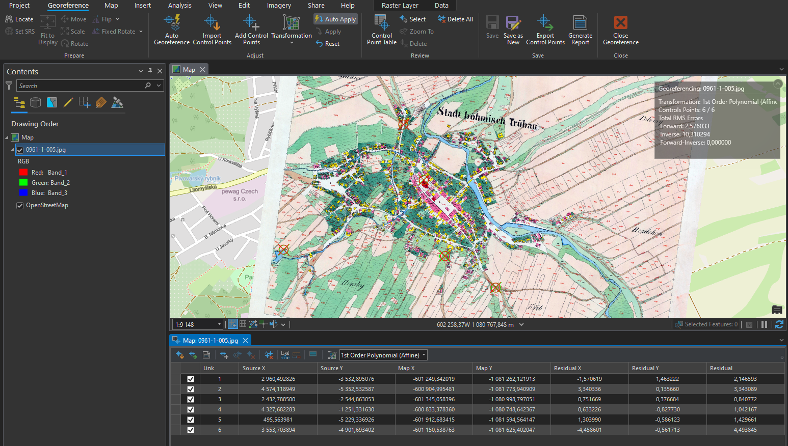
  <figcaption>Georeferencovaný mapový list</figcaption>
</figure>

???+ note "&nbsp;Zadávání souřadnic identických bodů:"
      Pokud známe souřadnice identického bodu, lze je zapsat ručně: klikneme na bod v připojované mapě → pravým kliknutím myši následně otevřeme nabídku, ve které se zadají souřadnice identického bodu v cílové mapě. Tuto metodu lze využít při georeferencování na geodeticky zaměřené body nebo na rohy mapového listů o známých souřadnicích (např. Topografické mapy v systému S–52).

**8.** Během procesu georeference je nutné sledovat přesnost výsledného souřadnicoého umístění dat. Tu na jdeme v tabulce _:material-tab: Control Point Table_{: .outlined_code}  v nástroji _:material-tab: Georeference_{: .outlined_code} . V této tabulce se nachází přehled všech identických bodů včetně jejich souřadnicových přesností. Můžeme zde také body mazat nebo je vyřadit z výpočtu transformace. Body jsou zároveň znázorněny v mapovém okně.

**9.** Při georeferencování v *ArcGIS Pro* lze použít několik druhů souřadnicových transformací. Druh transforamce volíme na základě vstupních dat. Pro ukázku s císařskými otisky stabilního katastru, je ideální afinní transformace, která se nabízí jako výchozí.

**10.** Pokud jsme spokojeni s georeferencováním, uložíme jej tlačítkem _:material-button-cursor: Save_{: .outlined_code} . Jestliže by bylo potřeba, je možné nastavení souřadnicového umístění změnit. Nástroj Georeference můžeme nyní zavřít _:material-button-cursor: Close_{: .outlined_code} .

???+ note "&nbsp;Georeferencování vytvoří pro každý rastr dva další soubory s parametry:"
      - JGWX – transformační klíč

      - XML – informace o souřadnicovém systému a parametrech georeference

### Vytvoření mozaiky

Pro vytvoření ucelené mapové vrstvy a následné zpracování rastrů, se využívá [__Mosaic Dataset__](https://pro.arcgis.com/en/pro-app/latest/help/data/imagery/mosaic-datasets.htm). Do mozaiky přesuneme požadované rastry. Mozaika vygeneruje vektorové vrstvy _:simple-databricks: Footprint_{: .outlined_code} a *:simple-databricks: Boundary*{: .outlined_code}.

  - Footprint slouží k ořezu mimorámových údajů každého rastru
  - Boundary je ohraničení celé mozaiky

**1.** _Mosaic Dataset_ vytvoříme kliknutím pravého tlačítka myši na geodatabázi v záložce _:material-tab: Catalog_{: .outlined_code}  → _:material-form-dropdown: New_{: .outlined_code} → _:material-form-dropdown: Mosaic Dataset_{: .outlined_code}.

<figure markdown>
  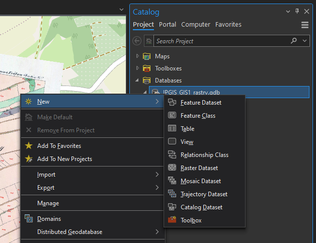{ width="450"}
  <figcaption>Vytvoření Mosaic Dataset</figcaption>
</figure>

**2.** V záložce _:material-tab: Geoprocessing_{: .outlined_code} se otevře funkce [_:material-cog: **Create Mosaic Dataset**_{: .outlined_code}](https://pro.arcgis.com/en/pro-app/latest/tool-reference/data-management/create-mosaic-dataset.htm), ve které vyplníme název mozaiky _Mosaic Dataset Name_{: .outlined_code} a příslušný souřadnicový systém _Coordinate System_{: .outlined_code} (ten je vhodné zvolit stejný jako v mapě – _Current Map_{: .outlined_code}). Ostaní parametry ponecháme ve výchozím nastavení.

<figure markdown>
  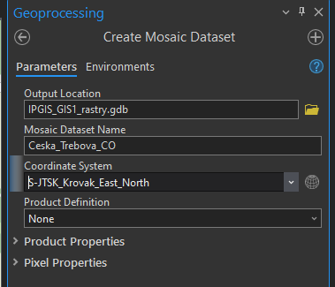{ width="300"}
  <figcaption>Vytvoření Mosaic Dataset</figcaption>
</figure>

**3.** Vytvořená mozaika se rovnou přidá do mapy, tudíž její vrstvu vidíme v záložce _:material-tab: Contents_{: .outlined_code}. Mozaika je stále prázdná, musíme do ní tedy přidat georeferencované rastry.

**4.** Pravým kliknutím na mozaiku v záložce _:material-tab: Catalog_{: .outlined_code} → _Add Rasters_ otevřeme funkci importu rastrů do mozaiky. Funkci lze najít i v záložce _:material-tab: Geoprocessing_{: .outlined_code} .

<figure markdown>
  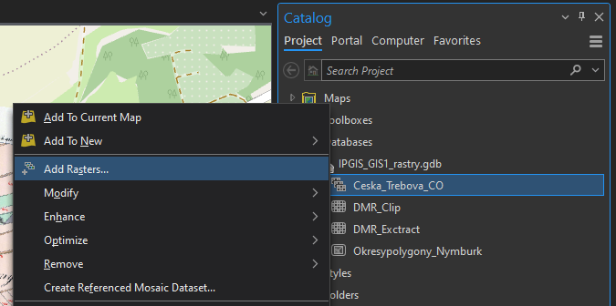{ width="500"}
  <figcaption>Přidání rastrů do mozaiky</figcaption>
</figure>

**5.** Ve funkci [_:material-button-cursor: **Add Rasters To Mosaic Dataset**_{: .outlined_code}](https://pro.arcgis.com/en/pro-app/latest/tool-reference/data-management/add-rasters-to-mosaic-dataset.htm) zvolíme výstupní mozaiku a ikonou s plusem v části _Input Data_ nahrajeme soubory. Pokud máme více georeferencovaných rastrů, je vhodné je uchovávat v jedné složce (včetně souborů určujících parametry transformace), kterou pak do mozaiky nahrajeme celou. V jiném případě můžeme nahrát přímo soubor tak, že změníme v *Input Data*{: .outlined_code} možnost _Folder_{: .outlined_code} na _File_{: .outlined_code}. Při výběru souboru v průzkumníku pak změníme CSV na všechny typy souborů a najdeme potřebné soubory. Ostatní parametry nyní ponecháme ve výchozím stavu.

<figure markdown>
  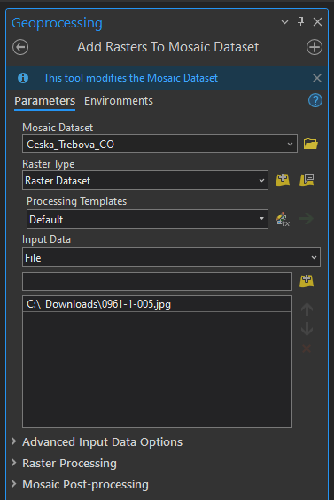{ width="300"}
  <figcaption>Přidání rastrů do mozaiky</figcaption>
</figure>

### Editování mozaiky

**1.** Pro vytvoření bezešvé mozaiky je potřeba nastavit hranice vrstvy _:simple-databricks: Footprint_{: .outlined_code} dle požadovaného ořezu dat.

**2.** V záložce _:material-tab: Edit_{: .outlined_code} zvolíme _:material-button-cursor: Edit Vertices_{: .outlined_code} a pro přidání, odebrání či posunutí lomových bodů využíváme nově otevřenou nabídku ikon v dolní části obrazovky. Pro uložení editace musíme stisknout ikonu _Finish_ dole ve zmíněné nabídce ikon a následovně _:material-button-cursor: Save_{: .outlined_code} nahoře vlevo v záložce _:material-tab: Edit_{: .outlined_code}. Vzhledem k tomu, že císařské otisky stabilního katastru jsou mapy bez pravidelného jednotného kladu mapových listů, je nutné editaci _Footprintu_ oklikat ručně. Automatický ořez _Footprintu_ lze použít například na data Státní mapy 1 : 5 000 – odvozené. Tato metoda je probírána v následujícím cvičení.

<figure markdown>
  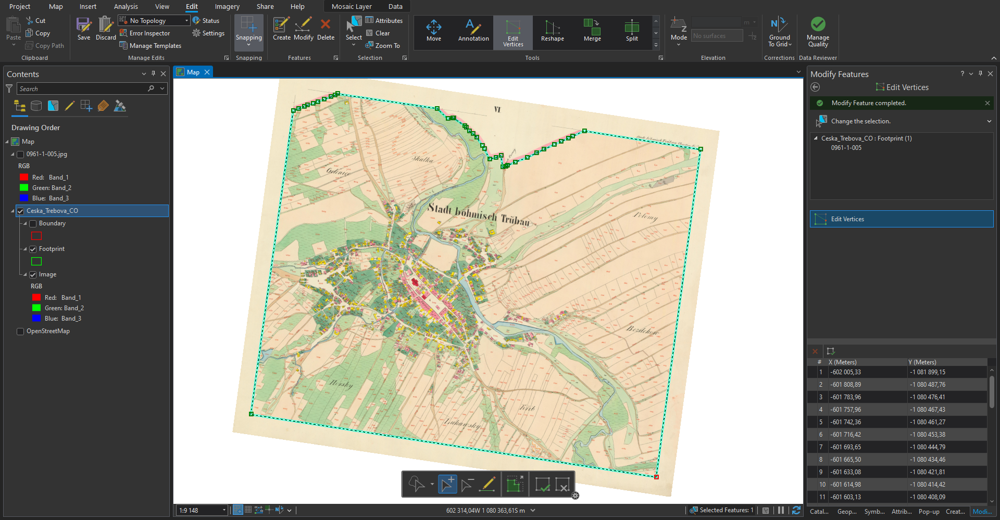
  <figcaption>Editace Footprintu</figcaption>
</figure>

**3.** Při editaci sousedících mapových listů je nutné lomové body přichytit na sebe se zapnutou funkcí _:material-button-cursor: Snapping_{: .outlined_code} v záložce _:material-tab: Edit_{: .outlined_code}. Jinak by nebyla mozaika bezešvá a obsahovala by díry.

**4.** Ořez rastru dle _Footprintu_ je nutné nastavit v parametrech mozaiky: v _:material-tab: Catalogu_{: .outlined_code} → kliknutím pravého tlačítka na mozaiku → _:material-form-dropdown: Properties_{: .outlined_code} → _:material-form-dropdown: Defaults_{: .outlined_code} → zaškrtnout _:octicons-checkbox-24: Always Clip the Raster to its Footprint_{: .outlined_code}. Pokud se nebudou další případné změny _Footprintu_ projevovat v mapě, je potřeba ve stejné nabídce vždy změnit _:material-form-dropdown: Default Mosaic Operator_{: .outlined_code} z *:material-form-dropdown: First*{: .outlined_code} na _:material-form-dropdown: Last_{: .outlined_code} a naopak.

<figure markdown>
  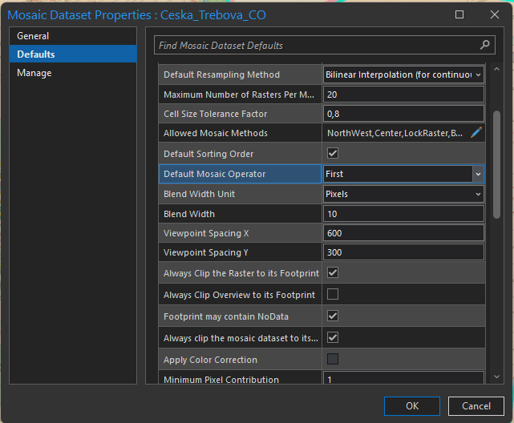{ width="450"}
  <figcaption>Parametry mozaiky</figcaption>
</figure>

**5.** Po potvrzení změny parametrů v parametrech mozaiky by se měly oříznout vybrané mimorámové údaje z mapového listu.

<figure markdown>
  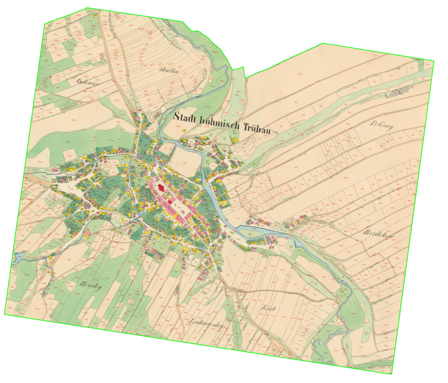{ width="800" }
  <figcaption>Hotová mozaika georeferencovaného mapového listu</figcaption>
</figure>

???+ note "&nbsp;Obnovení cesty k rastrům v mozaice"
      Pokud se změní umístění původních rastrových georeferencovaných souborů, které tvoří mozaiku, je možné cestu k nim jednoduše obnovit. 

      Kliknutím pravého tlačítka myši na danou mozaiku v sekci *:material-tab: Catalog*{: .outlined_code} → _:material-form-dropdown: Modify_{: .outlined_code} → _:material-form-dropdown: Repair Mosaic Dataset Paths..._{: .outlined_code} se nastaví nová cesta k rastrům.

      
## Úlohy k procvičení

!!! task-fg-color "Úlohy"

    K řešení následujích úloh použijte datovou sadu [ArcČR
    500](../../data/#arccr-500) verzi 3.3 dostupnou na disku *S* ve složče
    ``K155\Public\data\GIS\ArcCR500 3.3``. Zde také najdete souboru s
    popisem dat ve formátu PDF. Další datové vrstvy, která budete
    potřebovat pro vyřešení následujících úloh, jsou dostupné ke stažení
    jako [zip archiv](https://geo.fsv.cvut.cz/vyuka/155gis1/geodata/gis1-cviceni04.zip).

    **Práce s externími daty**
    
    1. Zjistěte kolik kamer pro měření rychlosti se nachází na území hlavního města Prahy?

    2. Určete celkovou výměru budov m^2^. Vrstvu budov je třeba
       transformovat na 2 měřené body podobnostní transformací

    3. Kolik vodojemů leží na území obcí pro které platí, že leží na
       hranici mapového listu TM100 a mají statuskod roven 3?

    **Georeferencování rastrových dat**

    1. Vizuálně zjistěte jaká je nejvíce zastoupená "barva" podloží v okrese Pelhřimov.

    2. Vizuálně zjistěte na jakém mapovém listu ZM25 leží Mšené Žehrovice.

    3. Vytvořte výsledný rastr, který bude v souřadnicovém systému UTM-33N
       (velikost pixelu 300m). Vrstvu vyexportujte do formátu GeoTIFF.

     